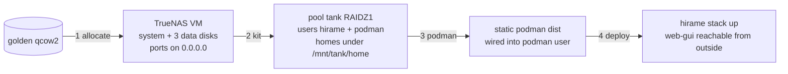

# IDEA — TrueNAS deployment scripts

Gate: confirmed by user, 2026-08-23

One command sequence turns the TrueNAS SCALE golden image into a running,
kitted TrueNAS VM with the full hirame stack deployed on it, verifiable from
another machine that can reach the host.

## Actors and situation

- **Operator** (the repository owner) on the libvirt-capable host that holds
  the golden image. Wants to stand up / re-stand-up a TrueNAS instance for
  verifying the hirame deployment, without clicking through the TrueNAS UI.
- Verification happens from other machines, so every exposed port must
  listen on `0.0.0.0` of the host, not on a libvirt-only bridge.

## The workflow, end to end

### UC1 — allocate the VM

One script, run with defaults, no arguments needed:

- creates `/var/lib/libvirt/images/<instance>/system.qcow2` as a qcow2
  backed by the golden image (copy-on-write, golden stays pristine), and
  `data-{0,1,2}.qcow2`, 32 GiB each;
- defines and starts the libvirt domain (`sudo virsh` where needed);
- exposes the TrueNAS UI, SSH, and the hirame GUI port on `0.0.0.0` via
  passt, so `http://<host-ip>:<port>` works immediately from any machine
  that reaches the host;
- prints exactly which host ports map to which guest ports at the end.

Overridable by environment variable, sensible defaults for all: golden image
path, image directory, instance name, memory/CPUs, port numbers.

Re-running against a half-existing instance must fail loudly or cleanly
recreate — never silently reuse stale disks. A companion "destroy" path
removes the domain and its images.

### UC2 — kit TrueNAS

One script, password read from an environment variable (default
`truenas-golden-image`), everything through the TrueNAS middleware so it
survives reboots:

- storage pool `tank`, RAIDZ1 over the three data disks, no log/cache vdevs;
- datasets: `tank/home`, homes `/mnt/tank/home/hirame` and
  `/mnt/tank/home/podman`;
- users `hirame` and `podman`, cleanly separated: each owns its own primary
  group; `podman` is the container runner and joins `hirame` as a
  supplementary group for host-side file sharing. The group-writable
  overwatch socket is handed to `podman`'s primary group (that is the one
  line `overwatch.service` changes — D3).

Idempotent: re-running on an already-kitted VM changes nothing and says so.

### UC3 — install static podman

One script that gets `podman-static-dist` (the static binary already on this
host's PATH, or freshly built) plus the tar artifact
(`./podman-static-v5.8.4.tar.zst`) onto the VM, installs the dist into the
`podman` user's home, and drops `~/.config/environment.d/75-podman.conf` so
the user manager sees the dist's quadlet setup. The `75-podman.conf` content
is **committed in this repository** (under `deploy/truenas/config/`), seeded
from this workstation's file — the script ships the repo copy, never reads
the operator's own `~/.config`.

### UC4 — deploy the hirame services

One script that builds the `deploy/dist` bundle (or reuses a fresh one),
copies it in, and runs `deploy/deploy.sh` with the TrueNAS knobs the README
already documents (`PODMAN=`, `OVERWATCH_BIN=`, generator symlink). It also
installs whatever persistence shim TrueNAS needs so subuid/subgid (and the
user-generator symlink) survive the reboot-time `/etc` regeneration —
verified by the success criterion: **after a VM reboot, the stack comes back
by itself**.

## Usability requirements

- Scripts are numbered and independently runnable; each one states its
  preconditions and fails fast with a message naming the earlier step when a
  precondition is missing.
- `sudo` is used only where root is genuinely needed (virsh system session,
  image directory); everything else runs as the invoking user.
- Every default is printed when used, so a run's configuration is always in
  the transcript.
- Failure experience: a failed remote step shows the remote command and its
  output verbatim — no "something went wrong".
- The final script ends by printing the URL to open from another machine.

## Settled idea-level calls

- One named instance at a time: `TRUENAS_VM_NAME`, default `truenas-hirame`
  (D1).
- Forwards on `0.0.0.0`: 10443→443 (TrueNAS UI), 10022→22 (ssh),
  18080→8080 (hirame web-gui, the stack's single published port) (D2).
- Runner user `podman` with its own primary group (privilege separation),
  supplementary in `hirame`; `deploy/deploy.sh` gains a `SERVICE_USER` knob
  (group derived from it) and repoints `overwatch.service`'s `Group=` (D3).
