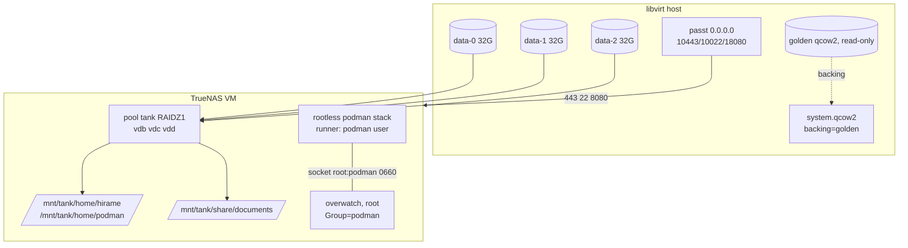

# PLAN — TrueNAS deployment scripts

Scripted allocation, kitting, podman installation, and hirame deployment for
a TrueNAS SCALE VM built from the golden image.

Idea gate: confirmed 2026-08-23 (IDEA.md).

## Goal / success criteria

- `deploy/truenas/01-vm.sh up` → `02-kit.sh` → `03-podman.sh` →
  `04-deploy.sh`, run in order with only `TRUENAS_ADMIN_PASSWORD` exported
  (or its default), ends with the hirame web GUI answering on host
  `0.0.0.0:18080`, reachable from outside the host.
- The kitted state (pool `tank`, users, homes) and the running stack survive
  a guest reboot, including TrueNAS's `/etc` regeneration (D6 shim).
- The golden image is never written to (backing file only).
- Each script is idempotent or fails loudly; re-runs never destroy data
  silently.

## Non-goals

- Building the golden image itself (exists at
  `/var/lib/libvirt/isos/ready/TrueNAS-SCALE-25.10.4-golden.qcow2`).
- The installer-ISO harness `go-overwatch/overwatch/e2e/vm-truenas/tnvm.sh`
  stays as-is (live env via raw qemu; this plan is an installed system via
  libvirt).
- Fixing the watcher's nested-dataset re-registration (user-flagged future
  work — HANDOFF.md).

## Context (grounded)

- `qemu-img`, `virsh`, `passt`, `qemu-system-x86_64` on PATH (nix profile);
  libvirt supports passt as backend of a `type='user'` interface with
  `<portForward>` rules.
- `deploy/deploy.sh` carries the appliance knobs (`PODMAN=`,
  `OVERWATCH_BIN=`, `DOCS_DIR=`, generator preflight) but hardcodes
  `SERVICE_USER=hirame` (deploy/deploy.sh:26) and the quadlet target dir
  `~/.config/containers/systemd` (deploy/deploy.sh:217,220).
- `overwatch.service` bakes `Group=hirame`; deploy/README.md's
  socket-handoff section prescribes exactly one line to change when the
  account layout differs.
- `podman-static-dist` v0.0.2 on PATH, statically linked; subcommands
  `install --tar`, `link`, `extract`. Artifact
  `./podman-static-v5.8.4.tar.zst` (repo root) contains `usr/local/...`
  binaries incl. `quadlet` under `usr/local/libexec/podman/` (and
  `podman-user-generator` under `usr/local/lib/systemd/user-generators/`), and
  `etc/environment.d/50-podman.conf` setting `PODMAN`, `PATH`,
  `QUADLET_UNIT_DIRS=~/.config/containers-quadlet`.
- TrueNAS constraints (deploy/README.md "Appliance hosts"): `/usr`
  immutable, `/home` noexec (homes go on the pool), user generators only
  from `/etc/systemd/user-generators`, static podman lacks the systemd tag
  (healthcheck driver timer already handled by deploy.sh), `/etc` files
  regenerated from the config DB at boot.

## Architecture



## Decided (full entries in DECISION.md)

- **D1** named single instance: `TRUENAS_VM_NAME`, default `truenas-hirame`;
  images under `/var/lib/libvirt/images/<name>/`.
- **D2** forwards on `0.0.0.0`: 10443→443 (UI), 10022→22 (ssh), 18080→8080
  (hirame web-gui — the stack's single published port).
- **D3** runner user `podman`, own primary group `podman`, supplementary in
  `hirame`; `hirame` a real user too; deploy.sh gains `SERVICE_USER` and
  derives the group; `overwatch.service` `Group=` rewritten to it.
- **D4** kitting over ssh (port 10022) as `truenas_admin` + `sudo midclt
  call`; password from `TRUENAS_ADMIN_PASSWORD`.
- **D5** deploy.sh's quadlet install dir becomes a knob (`QUADLET_DIR`);
  on TrueNAS it is `~/.config/containers-quadlet-additional`, matching the
  committed `75-podman.conf` verbatim. No symlinks.
- **D6** `/etc` persistence via a root systemd oneshot
  (`truenas-prep.service` + script under `/var/lib/hirame-deploy/`) that
  re-applies subuid/subgid entries and the
  `/etc/systemd/user-generators/podman-user-generator` symlink each boot.
  Empirically verify `/etc/systemd/system` survives a reboot; escalate to
  the belt-and-braces variant only if it does not.
- **D7** documents at `/mnt/tank/share/documents`: dataset `tank/share`,
  plain directory `documents` inside it — one ZFS filesystem, so the
  fanotify filesystem mark covers the watch root; nested datasets under a
  watch root are NOT covered (HANDOFF.md).

## Public surface delta

New directory `deploy/truenas/`; changed knobs in `deploy/deploy.sh`.

```sh
# ---- new files -------------------------------------------------------------
deploy/truenas/01-vm.sh        # up | down | destroy | status  (default: up)
deploy/truenas/02-kit.sh       # pool, datasets, groups, users
deploy/truenas/03-podman.sh    # static podman dist into the podman user
deploy/truenas/04-deploy.sh    # prep shim + build bundle + run deploy.sh
deploy/truenas/lib.sh          # shared env defaults + ssh/scp helpers
deploy/truenas/config/75-podman.conf        # committed, shipped verbatim
deploy/truenas/config/truenas-prep.service  # /etc persistence shim (unit)
deploy/truenas/config/truenas-prep.sh       # /etc persistence shim (script)

# ---- environment variables (defaults shown; every script sources lib.sh) --
TRUENAS_GOLDEN=/var/lib/libvirt/isos/ready/TrueNAS-SCALE-25.10.4-golden.qcow2
TRUENAS_IMAGE_DIR=/var/lib/libvirt/images     # per-instance subdir under it
TRUENAS_VM_NAME=truenas-hirame
TRUENAS_VM_MEM=8192                           # MiB
TRUENAS_VM_CPUS=4
TRUENAS_DATA_SIZE=32G                         # ×3 data disks, count fixed
TRUENAS_PORT_HTTPS=10443                      # -> guest 443
TRUENAS_PORT_SSH=10022                        # -> guest 22
TRUENAS_PORT_GUI=18080                        # -> guest 8080
TRUENAS_ADMIN_PASSWORD=truenas-golden-image
TRUENAS_HOST=127.0.0.1                        # where the forwards listen

# ---- allocated paths (from the request, defaults) --------------------------
$TRUENAS_IMAGE_DIR/$TRUENAS_VM_NAME/system.qcow2
$TRUENAS_IMAGE_DIR/$TRUENAS_VM_NAME/data-{0,1,2}.qcow2

# ---- example invocations ---------------------------------------------------
deploy/truenas/01-vm.sh up
deploy/truenas/02-kit.sh
deploy/truenas/03-podman.sh
deploy/truenas/04-deploy.sh
deploy/truenas/01-vm.sh destroy               # domain + images, asks first

# ---- deploy/deploy.sh delta (knobs; existing PODMAN/OVERWATCH_BIN/DOCS_DIR
#      keep their semantics) -------------------------------------------------
SERVICE_USER=${SERVICE_USER:-hirame}          # was hardcoded hirame
# SERVICE_GROUP is derived: id -gn "$SERVICE_USER" after the user exists;
# overwatch.service's Group=hirame is rewritten to it (same sed treatment
# as OVERWATCH_BIN), and the DOCS_DIR grant uses it.
QUADLET_DIR=${QUADLET_DIR:-}                  # default: ~SERVICE_USER/.config/containers/systemd

# ---- durable state created in the guest ------------------------------------
# pool tank: RAIDZ1 over the three data disks, no log/cache vdevs
# datasets:  tank/home, tank/share
# homes:     /mnt/tank/home/hirame, /mnt/tank/home/podman
# docs:      /mnt/tank/share/documents (plain directory in tank/share)
# groups:    hirame, podman;  users: hirame(g:hirame), podman(g:podman, +hirame)
# shim:      /etc/systemd/system/truenas-prep.service (enabled),
#            /var/lib/hirame-deploy/truenas-prep.sh
# podman:    ~podman/.local/share/podman-dist/<tag>/ + current symlink,
#            ~podman/.config/environment.d/75-podman.conf
```

`deploy/truenas/config/75-podman.conf` (committed, exact content):

```sh
QUADLET_UNIT_DIRS=${XDG_CONFIG_HOME:-$HOME/.config}/containers-quadlet:${XDG_CONFIG_HOME:-$HOME/.config}/containers-quadlet-additional
```

## Implementation steps

Each step is independently verifiable; verification named inline.

1. **Commit the config assets** — `deploy/truenas/config/75-podman.conf`
   (content above), `truenas-prep.service` (oneshot, `Before=user@.service
   systemd-user-sessions.service`, `WantedBy=multi-user.target`, ExecStart
   `/var/lib/hirame-deploy/truenas-prep.sh`), `truenas-prep.sh`
   (POSIX sh: ensure `podman:` lines in `/etc/subuid`/`/etc/subgid` — range
   computed once at install time and baked into the script by 04 — and
   `ln -sfn` the dist quadlet binary to
   `/etc/systemd/user-generators/podman-user-generator`).
   Verify: `systemd-analyze verify` on the unit (paths stubbed).
   Delivers: D6.
2. **Parametrize `deploy/deploy.sh`** — `SERVICE_USER` env knob (default
   `hirame`), derive `SERVICE_GROUP=$(id -gn "$SERVICE_USER")` after the
   user-exists check (derived, not a knob), sed `Group=hirame` →
   `Group=$SERVICE_GROUP` when installing `overwatch.service` **and the
   group column of the `/run/overwatch/hirame` line when installing
   `deploy/systemd/hirame-overwatch.tmpfiles.conf`** — that file bakes
   `hirame` too and its own comment requires it equal to `Group=`
   (deploy/systemd/hirame-overwatch.tmpfiles.conf:29). Use `SERVICE_GROUP`
   in the `DOCS_DIR` grant, and add `QUADLET_DIR` knob (default
   `$HIRAME_HOME/.config/containers/systemd`) for the unit install dir.
   Update deploy/README.md's appliance section for the new knobs.
   Verify: default-knob run through `deploy/test/` harness stays green;
   shellcheck. Delivers: D3 (script half), D5.
3. **`01-vm.sh`** — `up`: create
   `$TRUENAS_IMAGE_DIR/$TRUENAS_VM_NAME/system.qcow2` via `qemu-img create
   -f qcow2 -b "$TRUENAS_GOLDEN" -F qcow2` and `data-{0,1,2}.qcow2`
   (`$TRUENAS_DATA_SIZE`); render a domain XML (heredoc template: virtio
   disks vda..vdd, `<interface type='user'><backend type='passt'/>` with the
   three `<portForward>` ranges on `0.0.0.0`); `sudo virsh define` + `start`;
   refuse `up` when the domain or the image dir already exists (point at
   `destroy`). `down`: graceful shutdown. `destroy`: undefine + delete the
   instance image dir after an explicit confirmation. `status`: domain state
   + port map. Ends by printing the port table.
   Verify: `up` boots (console via `virsh console`), `nc -z 0.0.0.0 10443
   10022` from the host, golden image mtime/size unchanged.
   Delivers: D1, D2, request step (1).
4. **`02-kit.sh`** — over `ssh -p 10022 truenas_admin@$TRUENAS_HOST`
   (sshpass with `TRUENAS_ADMIN_PASSWORD`), `sudo midclt call`:
   `disk.get_unused` → expect the three data disks; `pool.create` `tank`
   RAIDZ1 over them (no log/cache); `pool.dataset.create` `tank/home` and
   `tank/share`; `group.create` `hirame`, `podman`; `user.create` `hirame`
   (home `/mnt/tank/home/hirame`, primary group `hirame`) and `podman`
   (home `/mnt/tank/home/podman`, primary group `podman`, aux group
   `hirame`, shell `/usr/bin/bash`); `mkdir -p /mnt/tank/share/documents`
   with group `podman`, `g+rX`. Every create guarded by a query first —
   re-run prints "already kitted".
   Verify: re-run idempotence; `zpool status tank` shows raidz1-0 with 3
   disks; `id podman` shows `g=podman groups=podman,hirame`.
   Delivers: D4, D7 (creation half), request step (2).
5. **`03-podman.sh`** — scp the static `podman-static-dist` binary (from
   PATH; abort if `ldd` says it is dynamic, with the build command as the
   message) and the tar artifact to the VM. Artifact lookup order:
   `PODMAN_STATIC_TAR` env override →
   `~/.cache/dotfiles/build/podman-static/out/podman-static-v5.8.4.tar.zst`
   (the standard location) → `./podman-static-v5.8.4.tar.zst` (this setup's
   accidental in-repo copy — HANDOFF H2); as `podman`
   (via `sudo runuser` from the truenas_admin ssh session, HOME/XDG set as
   deploy.sh's `as_hirame` does): `podman-static-dist install --tar ...`;
   install `config/75-podman.conf` to
   `~podman/.config/environment.d/75-podman.conf`;
   `sudo loginctl enable-linger podman`.
   Verify: `runuser -u podman -- .../current/usr/local/bin/podman info`
   succeeds; `systemctl --user show-environment` (as podman) contains the
   dist `QUADLET_UNIT_DIRS`.
   Delivers: request step (3).
6. **`04-deploy.sh`** — run `deploy/build.sh` unless a fresh
   `deploy/dist` is present (precondition: local podman + go; fail with
   instructions otherwise); scp the bundle; install the D6 shim (bake the
   subuid range into `truenas-prep.sh`, install unit + script,
   `systemctl enable --now truenas-prep.service`); then run the bundle's
   `deploy.sh` in the VM:
   `sudo env SERVICE_USER=podman QUADLET_DIR=/mnt/tank/home/podman/.config/containers-quadlet-additional
   PODMAN=/mnt/tank/home/podman/.local/share/podman-dist/current/usr/local/bin/podman
   OVERWATCH_BIN=/var/lib/overwatch/overwatch DOCS_DIR=/mnt/tank/share/documents ./deploy.sh`.
   Ends by printing `http://<host>:18080`.
   Verify: `curl -fs http://127.0.0.1:18080` from the libvirt host; socket
   handoff check inside deploy.sh passes as user `podman`.
   Delivers: D3 (deployment half), D5 (TrueNAS-side value), D6 (install),
   D7 (DOCS_DIR wiring), request step (4).
7. **End-to-end + reboot verification** — fresh `destroy` → 01–04;
   `virsh reboot`; assert pool imports, `id podman` intact, subuid/subgid
   lines present, generator symlink present, stack returns unattended
   (`curl :18080`), then re-run 02–04 asserting idempotence. Record results
   in STATUS.md.
   Delivers: success criteria; D6 empirical check.

## Testing / verification

- Per-step checks as listed above; shellcheck over `deploy/truenas/*.sh`.
- The one empirical unknown is D6's premise (`/etc/systemd/system` survives
  TrueNAS reboot) — step 7 tests it explicitly; fallback recorded in D6.
- `deploy/test/` harness continues to cover the non-TrueNAS default path of
  the parametrized deploy.sh (step 2).

## Risks

- Golden image assumptions (ssh enabled, password auth, `truenas_admin`
  sudo): 02 preflights with a single `ssh ... sudo -n midclt call
  system.info` and fails with a message naming the assumption.
- passt `<portForward>` needs a reasonably recent libvirt; 01 preflights
  `virsh version` and falls back to an error naming the requirement.
- `deploy/build.sh` needs local podman + go; 04 checks and reports rather
  than half-building.
- TrueNAS middleware API names/args differ across versions; scripts pin to
  25.10 (the golden image) and say so in their headers.

## Open questions

(none — all resolved; see DECISION.md D1–D7)
